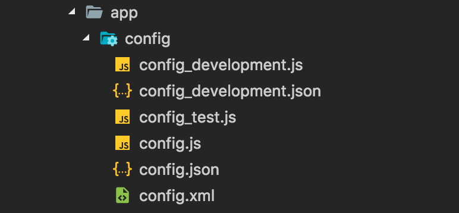

## Installation

```bash
npm install @brainhubeu/hadron-json-provider --save
```

[More info about installation](/core/#installation)

## Overview

JSON Provider allows you to automatically load multiple files as a JSON object, with file names as object keys, and file contents as object values.

Currently it supports the following extensions:

* `.js`
* `.json`
* `.xml`

## Usage

### Basic provider

```javascript
jsonProvider(paths, extensions);
```

* `paths` - array of strings which contains paths to files
* `extensions` - array of strings which contains extensions of files out of which which you want to build a JSON object

For example, consider a directory with the following structure:


To find all files in `./routing` and its sub-directories with the extension `config.js` you can use the following code:

```javascript
jsonProvider(['./routing/**/*'], ['config.js'])
  .then((object) => {})
  .catch((error) => {});
```

### Configuration provider

```javascript
configJsonProvider(paths, configFile, projectType, extensions);
```

* `paths` - array of strings which contains paths to files
* `configFile` - name of the main configuration file
* `projectType` - project type
* `extensions` - array of strings which contains extensions of files out of which you want to build a JSON object

For example, consider a directory with the following structure:



If you want to build a configuration object which depends on the project type, for example `development`, you can use the following code:

```javascript
configJsonProvider(['./app/config/*'], 'config', 'development', ['xml', 'js'])
  .then((object) => {})
  .catch((error) => {});
```
